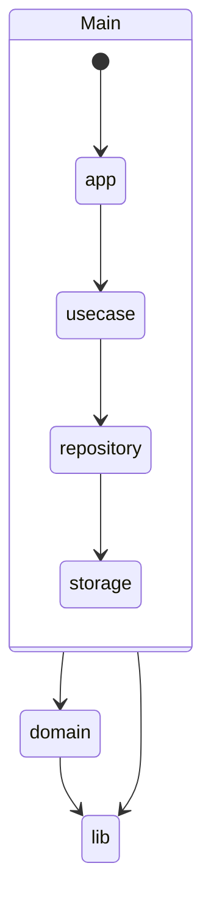

# Internal Layer

- [Description](#description)
- [Diagram](#diagram)
- [App SubLayer](#app-sublayer)
  - [Details](app/readme.md)
- [Domain SubLayer](#domain-sublayer)
  - [Details](domain/readme.md)
- [Use-Case SubLayer](#use-case-sublayer)
  - [Details](usecase/readme.md)
- [Repository SubLayer](#repository-sublayer)
  - [Details](repository/readme.md)
- [Lib SubLayer](#lib-sublayer)
  - [Details](lib/readme.md)
- [Storage SubLayer](#storage-sublayer)
  - [Details](storage/readme.md)

## Description
Этот уровень является основной *начинкой* приложения, которая содержит бизнес-логику, модели, хранилища и т.д.
К донному слою имеют доступ только слой `CMD`.
Слой имеет подуровни, которые описаны ниже.

В своем пример я хотел показать, что процесс взаимодействия между слоями этого уровня по следующему принципу:
- `app` слой обращается к `usecase` процессам
- `usecase` процессы взаимодействют с `repository` слоем данных
- `repository` слой данных взаимодействует с `storage` слоем хранения данных
- слой `domain` является общим для всех и не имеет доступа к другим слоям, кроме слоя `lib`
- слой `lib` является так же как и `domain` общим для всех и не имеет доступа к другим слоям

---

This layer is the main *core* of the application which contains business logic, models, repositories, etc.
Only the `CMD` layer has access to this layer.
The layer has sublayers described below.

In my example, I wanted to show that the process of interaction between the layers of this layer according to the following principle:
- `app` layer refers to `usecase` processes
- `usecase` processes interact with the `repository` data layer
- `repository` data layer interacts with the `storage` data storage layer
- the `domain` layer is common to all and does not have access to other layers, except for the `lib` layer
- the `lib` layer is also common to all and does not have access to other layers

## Diagram

## App SubLayer

Этот подуровень содержит описания подпрограмм.
В моем примере подпрограммой является `http` сервер, который имеет разные модули. 
Например, модулю `inbox` и `outbox`.

Название директории для данного слоя - `app`.

Более подробное описание подуровня в директории [app](app/readme.md).

---

This sublayer contains descriptions of subprograms.
In my example, a subprogram is an `http` server that has different modules.
For example, the `inbox` and `outbox` modules.

The directory name for this layer is `app`.

More detailed description of the sublayer in the [app](app/readme.md) directory.

## Domain SubLayer

Этот подуровень содержит описания моделей доменной области приложения. В этом слое не должно быть никакой бизнес-логики,
только описания предметной части выраженной в коде. 
Описываются все объекты принимающие участие в бизнес-процессе, например: модель `user`, `transaction` или агрегат `transaction`.
Я предпочитаюс максимольно задокументировать данную часть приложения, чтобы любой другой человек мог понять все детали.

Данный слой не имеет доступа к другим слоям приложения, кроме слоя `lib`.

Название директории для данного слоя - `domain`.

Более подробное описание подуровня в директории [domain](domain/readme.md).

---

This sublayer contains descriptions of domain models of the application. This layer should not have any business logic,
only descriptions of the subject area expressed in code. 
All objects participating in the business process are described, for example: the `user`, `transaction` model or the `transaction` aggregate.
I prefer to document this part of the application as much as possible so that any other person can understand all details.

This layer does not have access to other layers of the application, except for the `lib` layer.

The directory name for this layer is `domain`.

More detailed description of the sublayer in the [domain](domain/readme.md) directory.

## Use-Case SubLayer

Этот подуровень содержит описания бизнес-процессов приложения, сервисный слой. Как описать и выразить бизнес-процесс решать вам. 
В моем примере я использую два интерфейса, для описания процесса для `inbox` и `outbox`.

Название директории для данного слоя - `usecase`.

Более подробное описание подуровня в директории [usecase](usecase/readme.md).

---

This sublayer contains descriptions of the business processes of the application, the service layer. How to describe and express the business process is up to you.
In my example, I use two interfaces to describe the process for `inbox` and `outbox`.

The directory name for this layer is `usecase`.

More detailed description of the sublayer in the [usecase](usecase/readme.md) directory.

## Repository SubLayer

Этот подуровень является сервисным слоям отвечающий за работу с хранилищем.
В моем примере я использую репозитории для отдельных `usecase` бизнес-процессов, которые взаимодействую с интрейфесами других репозиторий.
Остальные репозитории используються для отдельных моделей или агрегатов в зависимости от типа хранилища и их название отражает тип хранилища.
Например, репозиторий: `User`, `UserCahce` и `Transaction`, `TransactionCasche` для моделей `user` и `transaction`, интерфейсы реализуют структуры `UserPG`, `UserCascheRD`, `TransactionPG`, `TransactionCacheRD`, где префикс `PG` - **postgres** и `RD` - **redis**.
Так же как и в слое `domain` я предпочитаю детально документировать интейрфесы, которые описывают бизнес-процессы.

Название директории для данного слоя - `repository`.

Более подробное описание подуровня в директории [repository](repository/readme.md).

---

This sublayer is a service layer responsible for working with the repository.
In my example, I use repositories for individual `usecase` business processes that interact with the interfaces of other repositories.
The rest of the repositories are used for individual models or aggregates depending on the type of repository and their name reflects the type of repository.
For example, the repository: `User`, `UserCahce` and `Transaction`, `TransactionCasche` for the `user` and `transaction` models, the interfaces implement the `UserPG`, `UserCascheRD`, `TransactionPG`, `TransactionCacheRD` structures, where the prefix `PG` - **postgres** and `RD` - **redis**.
As in the `domain` layer, I prefer to document in detail the interfaces that describe business processes.

The directory name for this layer is `repository`.

More detailed description of the sublayer in the [repository](repository/readme.md) directory.

## Lib SubLayer

Этот подуровень является слоем библиотек, которые используются в приложении. 
Данный слой может иметь доступ только к слои `config`

Название директории для данного слоя - `lib`.

Более подробное описание подуровня в директории [lib](lib/readme.md).

---

This sublayer is a layer of libraries used in the application.
This layer can only have access to the `config` layer

The directory name for this layer is `lib`.

More detailed description of the sublayer in the [lib](lib/readme.md) directory.

## Storage SubLayer

Этот подуровень является слоем хранилища данных. В нем описываются все хранилища используемые в приложении.

Название директории для данного слоя - `storage`.

Более подробное описание подуровня в директории [storage](storage/readme.md).

---

This sublayer is a data storage layer. It describes all the storages used in the application.

The directory name for this layer is `storage`.

More detailed description of the sublayer in the [storage](storage/readme.md) directory.