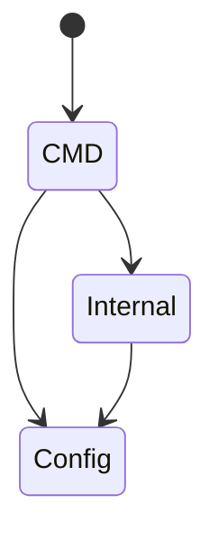

# Golang Project Layout

A Golang project structure including a simple example.

    
    

## Goals

The main goals of this project are:
 - Show service structure for Golang projects with a simple example
 - Show how it's to use DI in Golang by `go.uber.org/fx` and how it can be convenient
 - Show how easy it's to work when project structure has boundaries between layers

## Features

Here are some of the project's features:

 - Ease of scalability for the project
 - Clear description of the project's domain area 
 - No need to worry about errors with cyclic imports
 - Support for modularity
 - Ease to use

## Project Structure

I like to split the project into several layers, each of which has its own responsibilities and boundaries.

For me, any projects have the main layers:
  - `CMD` - entry point for the application, in this layer we describe how to run the application
  - `Internal` - the main layer of the application, in this layer we describe the domain area and business logic of the application/s
  - `Config` - the layer of the application that is responsible for the configuration of the application/s, I call this layer as *house foundation*

    I want to pay attention to the fact that the project structure is not a dogma, it is just a recommendation.

In *layer relationship diagram* you can see that project structure has boundaries between layers and what is it knowing about each other.

`CMD` layer knows about `Internal` and `Config` layers, `Internal` layer knows only about `Config` layer. `Config` layer knows nothing about other layers.

**Layer relationship diagram:**

Each layer has detailed description in the `readme.md` file inside the layer directory.

- [CMD Layer](cmd/readme.md)
- [Internal Layer](internal/readme.md)
- [Config Layer](config/readme.md)

For root directory, I'd like to use files that are responsible for the service and help to use this service.
In my example, I use `Makefile` and `docker-compose.yml` files. Usually you want to open root directory and use something quickly.
Also in the golang service you can use `go.mod` and `go.sum` files.

## Project Example

In this project, I will show you how to use the project structure and how to use DI in Golang.
For example, I will use a simple application that will have two applications: `inbox` and `outbox`.

The `inbox` application will be responsible for handling request on creating *payment transaction* from the user, 
and the `outbox` application will be responsible for handling request for showing *payment transaction* from the user.

For this example, I will use the `http` server, using the `http` server I'll show you how you can use versioning and why you should use `uber.fx`.

P.S. I will not describe the application logic in detail, I will only show the structure of the application and how to use DI in Golang. Some time you can see not optimized code, because the goal was to show project structure.

